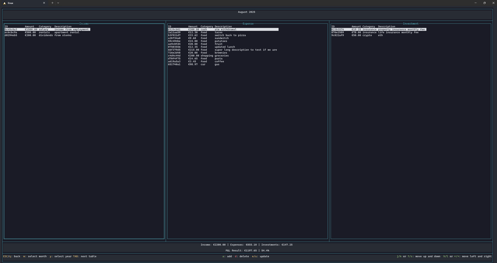
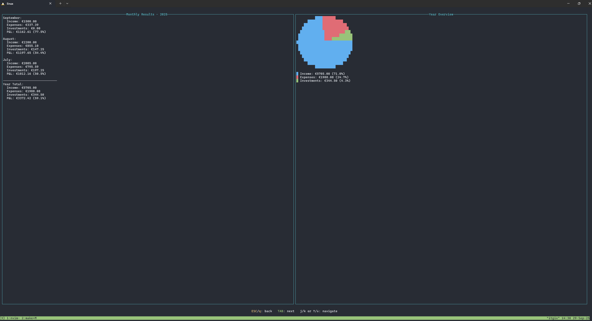
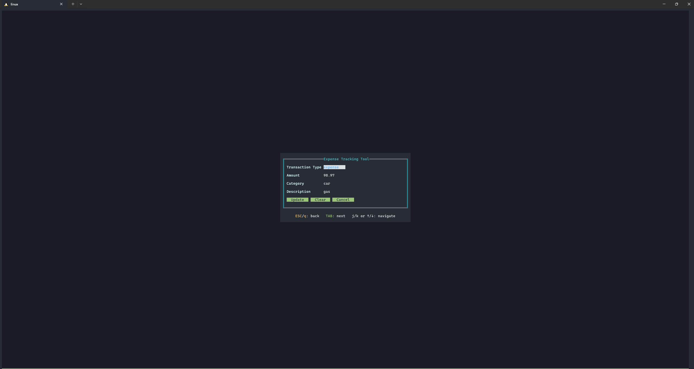
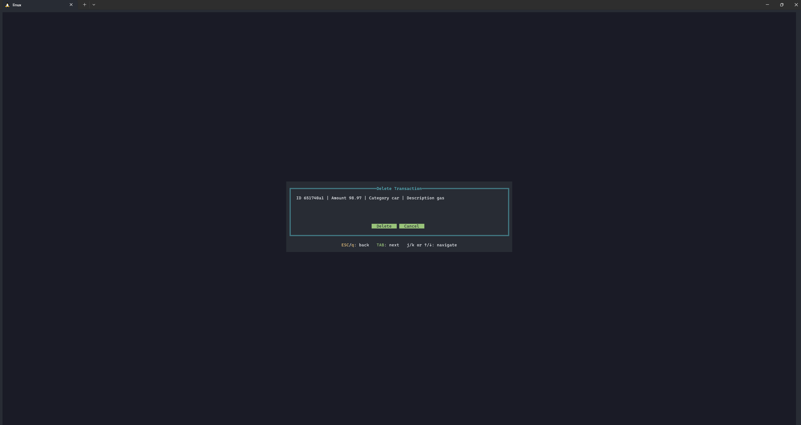

# expense tracking CLI tool
Track your expenses in the terminal

List of Transactions Page

Year Summary and P&L

Add Transactions

Update Transactions

Delete Transactions

Navigating the Menus


## Installation 

Download a release from https://github.com/boris-yakimov/expense-tracking/releases  

Or directly download the latest release in your terminal  

Linux x86  
```sh
# download latest release
wget -qO- https://api.github.com/repos/boris-yakimov/expense-tracking/releases/latest \
  | grep "browser_download_url" \
  | grep "expense-tracking-linux-amd64" \
  | cut -d '"' -f 4 \
  | xargs wget

chmod +x expense-tracking-linux-amd64 

./expense-tracking-linux-amd64
```

Linux ARM  
```sh
# download latest release
wget -qO- https://api.github.com/repos/boris-yakimov/expense-tracking/releases/latest \
  | grep "browser_download_url" \
  | grep "expense-tracking-linux-arm64" \
  | cut -d '"' -f 4 \
  | xargs wget

chmod +x expense-tracking-linux-arm64 

./expense-tracking-linux-arm64
```

Windows  
Download a release and just run the .exe {not shady at all :)}
or via powershell  
```posh
# Download the latest release ZIP for Windows amd64
Invoke-RestMethod -Uri "https://api.github.com/repos/boris-yakimov/expense-tracking/releases/latest" `
  | Select-Object -ExpandProperty assets `
  | Where-Object { $_.name -like "*windows-amd64.zip" } `
  | ForEach-Object { Invoke-WebRequest $_.browser_download_url -OutFile "expense-tracking-windows-amd64.zip" }

# Extract the ZIP
Expand-Archive -Path "expense-tracking-windows-amd64.zip" -DestinationPath "." -Force

# Run the executable (assumes it's now in the current folder)
.\expense-tracking-windows-amd64.exe
```


## Authentication & Encryption Overview

This project uses **password-based encryption** to protect the SQLite database that stores expense tracking data.  
The system is designed so that the database on disk is stored **encrypted**. It is only decrypted into plaintext form at runtime after the user successfully authenticates and than re-encrypted back after exit(re-encryption also happens if the program is crashed).

---

### 🔑 Authentication Flow

1. **First Run**
   - When the program starts, it checks if an encrypted database file (`encFile`) exists.
   - If not, the user is prompted to create a new password via the **Set New Password** form.
   - That password is stored in memory and used to derive an encryption key.

2. **Subsequent Runs**
   - On startup, the **Login Form** asks the user to enter their password.
   - The entered password is stored temporarily in memory (`userPassword`).
   - That password is used to derive an encryption key and attempt decryption of the database file.

---

### 🔒 Encryption Details

- **Algorithm:** AES-GCM (Galois/Counter Mode)
  - Provides both confidentiality and integrity (authenticates ciphertext).
- **Key Derivation:** A function (`deriveEncryptionKey`) derives a cryptographic key from the user’s password.  
  - This ensures that the actual AES key is never stored or hardcoded.
- **File Format:**
  - Each encrypted file begins with a random **nonce** (generated during encryption).
  - The nonce is followed by the AES-GCM ciphertext (which also contains the authentication tag).

## Storage Configuration

The expense tracking tool now supports configurable storage backends. Primary storage option SQLite (default). Previously a JSON file storage was also supported but is now deprecated.

### Environment Variables (optional)

- `EXPENSE_STORAGE_TYPE`: Set to `"sqlite"` (default) (previously JSON was supported, but was deprecated)
- `EXPENSE_UNENCRYPTED_DB_PATH`: Path to unencrypted SQLite database file (default: `"~/.expense-tracking/transactions.db"`)
- `EXPENSE_ENCRYPTED_DB_PATH`: Path to encrypted database file (default: `"~/.expense-tracking/transactions.enc"`)
- `EXPENSE_LOG_PATH`: Path to log file (default: `"~/.expense-tracking/expense-tracking.log"`)
- `EXPENSE_SALT_PATH`: Path to salt file (default: `"~/.expense-tracking/transactions.salt"`)

### Usage Examples

**Use SQLite storage (default):**
```bash
./expense-tracker
```

**Use custom SQLite path:**
```bash
EXPENSE_UNENCRYPTED_DB_PATH=/path/to/my/database.db ./expense-tracker
```


## Backup and Restore

The encrypted database file (`transactions.enc`) and the salt file (`transactions.salt`) are stored in `~/.expense-tracking/` by default.

### Backup

1. Locate the files: `~/.expense-tracking/transactions.enc` and `~/.expense-tracking/transactions.salt`
2. Copy them to a secure backup location, such as an external drive or cloud storage.

### Restore

1. Ensure the expense tracking program is not running.
2. Copy the backed-up `transactions.enc` and `transactions.salt` files back to `~/.expense-tracking/`
3. Start the program and log in with your password.

Note: Both files must be restored together for the encryption to work properly. If using custom paths via environment variables, adjust the paths accordingly.

## Compile source

Dependencies
```sh
sudo apt install gcc-aarch64-linux-gnu
sudo apt install gcc-mingw-w64
```

Compile
```sh
make compile

~/repos/expense-tracking main !1 ❯ make compile
rm -f bin/expense-tracking-*
env GOOS=linux GOARCH=amd64 CGO_ENABLED=1 go build -o bin/expense-tracking-linux-amd64 .
# requires ARM cross compiler to be installed - sudo apt install gcc-aarch64-linux-gnu
env GOOS=linux GOARCH=arm64 CGO_ENABLED=1 CC=aarch64-linux-gnu-gcc go build -o bin/expense-tracking-linux-arm64 .
# requires MinGW cross compiler to be installed - sudo apt install gcc-mingw-w64
env GOOS=windows GOARCH=amd64 CGO_ENABLED=1 CC=x86_64-w64-mingw32-gcc go build -o bin/expense-tracking-windows-amd64.exe .

ls -lah bin/
-rwxrwxr-x 1 boris boris 9.3M Sep 26 11:21 expense-tracking-linux-amd64
-rwxrwxr-x 1 boris boris 8.9M Sep 26 11:21 expense-tracking-linux-arm64
-rwxrwxr-x 1 boris boris  17M Sep 26 11:21 expense-tracking-windows-amd64.exe
```
